# Satellite Image Generator 🛰️
Quick hack I put together. Diffusion (DDIM or DDPM) from scratch to generate sentinel-2 10m resolution synthetic imagery. Images generated are only 64x64px.  

## Sample Generations
| Final Result | Generation Process Gif (upscaled to 256px)|
| :---: | :---: |
| 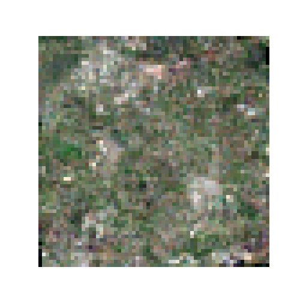 | 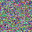 |
| 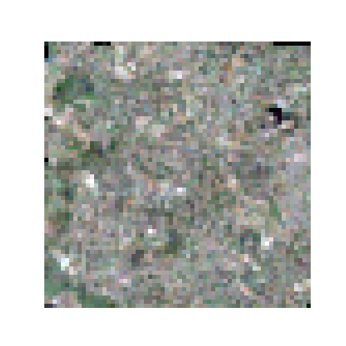 | 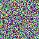 |
| 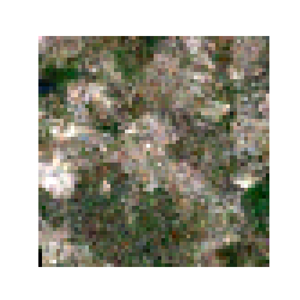 |  |
| 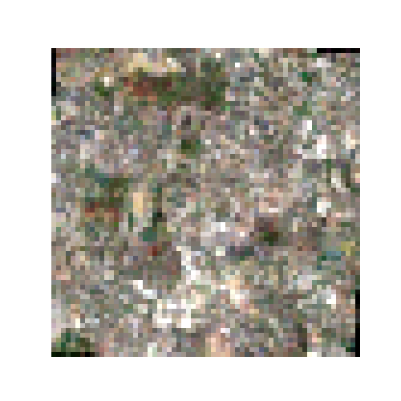 | 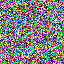 |
| 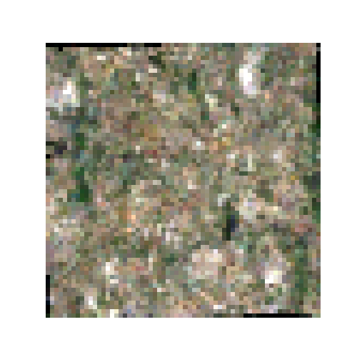 |  |
| 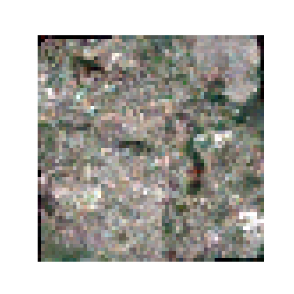 | 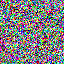 |
| 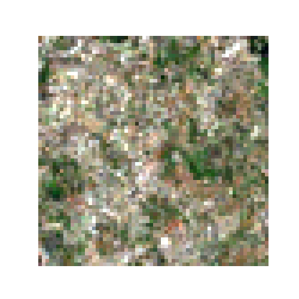 | 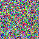 |
| 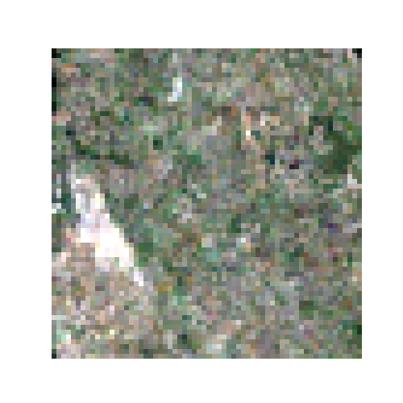 | 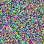 |
| 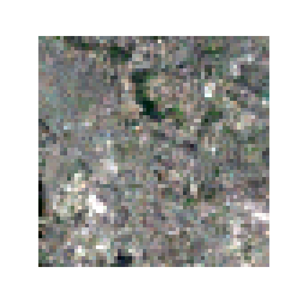 | 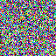 |
| 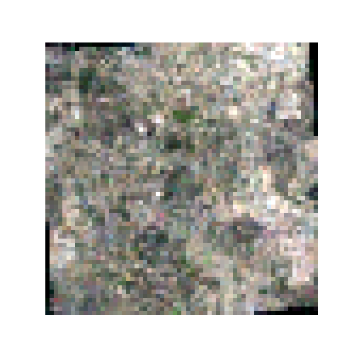 | 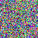 |
| 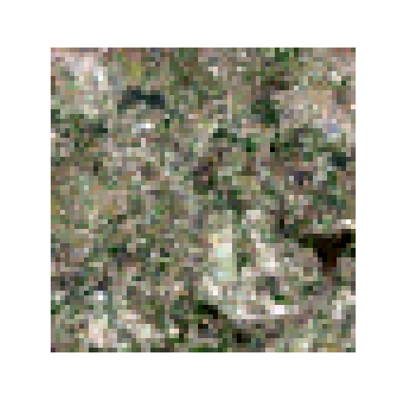 |  |
| 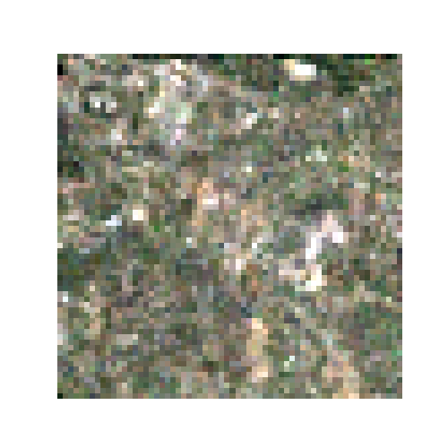 |  |
| 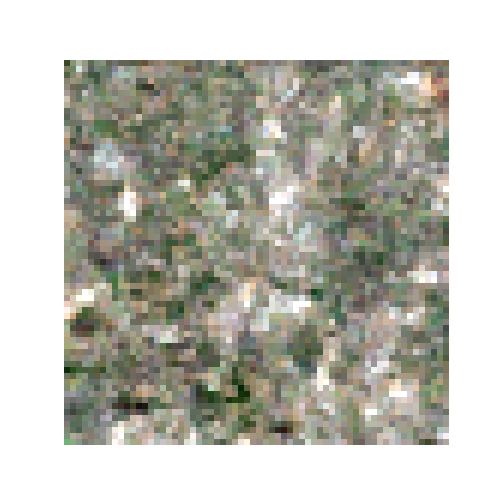 | 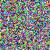 |
| 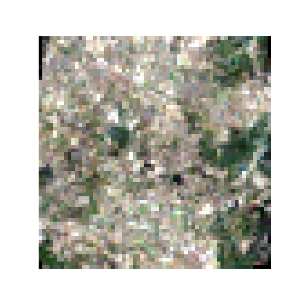 | 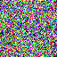 |
| 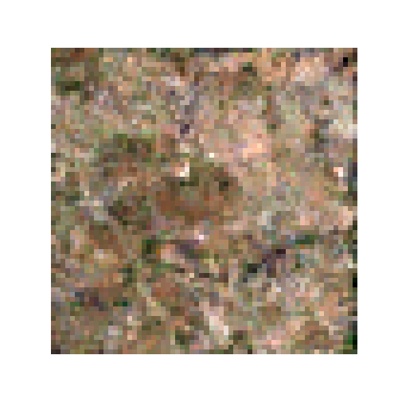 | 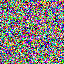 |
|  | 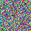 |

## Results - 60 epochs, > 20,000 steps

